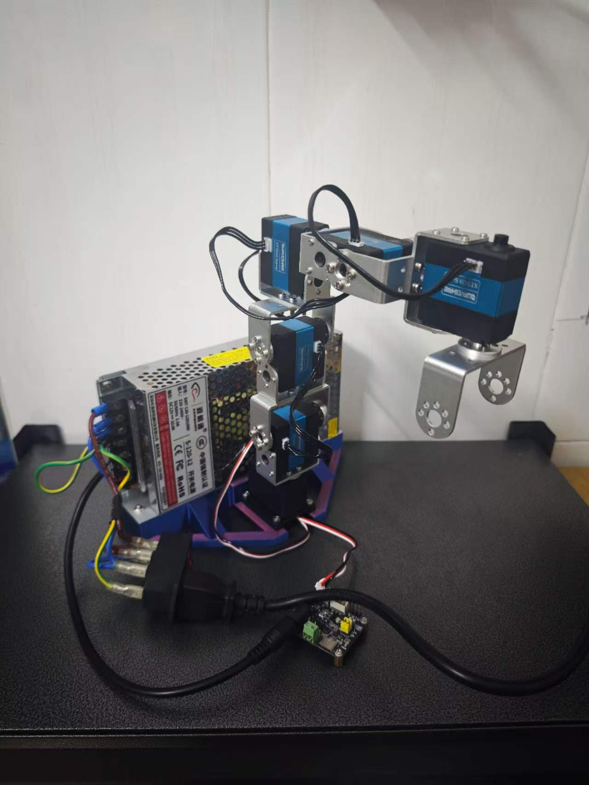
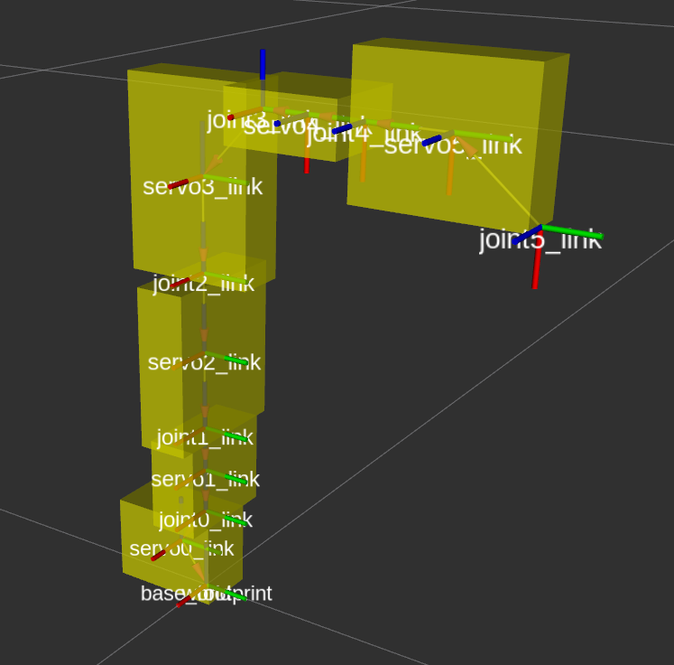

# Robotic Arm

一个基于 **ROS 2 Humble** 的六轴机械臂工作空间，集成了：

- `ros2_control` 控制链路
- MoveIt 2 运动规划与执行
- Gazebo 仿真
- 真实舵机硬件驱动
- 调试舵机软件

本来项目用于学习ros2_control + movit，跑仿真就够了。
---

## ✨ 功能特性

- ✅ 六轴机械臂 `URDF/Xacro` 模型
- ✅ `ros2_control` + 自定义控制器 `arm_controller`
- ✅ Gazebo 仿真链路（`ros_gz_sim` / `gz_ros2_control`）
- ✅ MoveIt 2 路径规划与轨迹执行
- ✅ 真实舵机驱动接口（`servo_hardware` / `servo_manager`）
- ✅ 仿真与真机使用**独立控制参数文件**，切换更方便

---

## 📦 仓库结构

| 包名 | 说明 |
|---|---|
| `arm_description` | 机械臂模型、`ros2_control` 配置、仿真/真机启动文件 |
| `arm_controller` | 自定义 ROS 2 控制器插件，负责接收和执行轨迹 |
| `arm_moveit` | MoveIt 2 配置包，包含规划、控制器映射与 RViz 配置 |
| `servo_hardware` | 真实硬件 `SystemInterface` 实现 |
| `servo_manager` | 舵机底层通信与控制封装 |
| `servo_widget` | Qt 调试舵机软件 |

---

## 🔧 环境要求

建议环境：

- Linux
- ROS 2 Humble
- MoveIt 2
- `ros2_control`
- `ros_gz_sim` / `gz_ros2_control`
- RViz 2

> 如用于真机，请确认串口设备、供电和急停保护已正确配置。

---

## 🚀 快速开始

### 1. 编译工作空间

```bash
source /opt/ros/humble/setup.bash
cd robotic_arm
rosdep install --from-paths src --ignore-src -r -y
colcon build --symlink-install
source install/setup.bash
```

---

## 🧪 启动仿真

```bash
source /opt/ros/humble/setup.bash
cd robotic_arm
source install/setup.bash
ros2 launch arm_moveit arm_moveit_sim.launch.py
```

该命令会启动：

1. Gazebo 仿真环境
2. `robot_state_publisher`
3. `joint_state_broadcaster`
4. `arm_controller`
5. MoveIt `move_group`
6. MoveIt RViz 界面

---

## 🤖 启动真实机器人

在启动前，请先检查：

- 串口设备路径是否正确（默认见 `src/arm_description/urdf/ros2_control.xacro` 中的 `/dev/ttyACM0`）
- 舵机供电是否稳定
- 机械臂周围是否具备安全操作空间

启动命令：

```bash
source /opt/ros/humble/setup.bash
cd robotic_arm
source install/setup.bash
ros2 launch arm_moveit arm_moveit_real.launch.py
```

---

## ⚙️ 控制参数说明

### 控制器配置文件

- **仿真**：`src/arm_description/config/arm_controllers_sim.yaml`
- **真机**：`src/arm_description/config/arm_controllers_real.yaml`

这样切换仿真与真机时，不需要反复修改同一个 YAML 文件。

### `servo_velocity` 参数语义

`arm_controller` 中的 `servo_velocity` 用于决定是否启用舵机简化模式：

其含义如下：
| 值 | 行为 |
|---|---|
| **未设置 / `NaN`** | 不启用舵机简化模式，使用完整规划轨迹 |
| **小于 0** | 启用舵机模式，速度使用规划结果 |
| **大于 0** | 启用舵机模式，按设定速度执行，单位为 `rad/s` |

---

# 展示

## 机械臂实物



##  RViz 界面



## 📄 License

本仓库根目录采用 `Apache-2.0` 许可证，详见 `LICENSE`。
